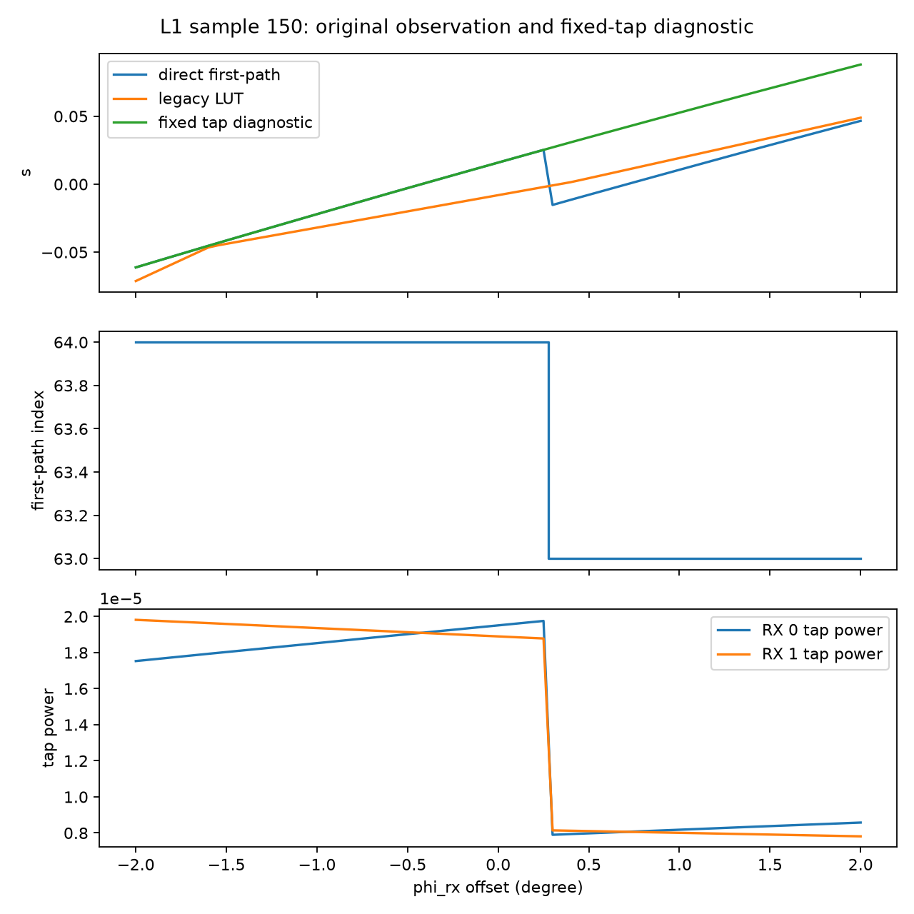

# DRIVE_SIM 3단계 L1 독립 재현 및 원인 분해

이번 작업은 실제 LP±45 FFD bank와 원 2° LUT를 사용한 **L1만 완료**했다. max 오차 **0.023972114650869**, median **0.000530241472996**, max 기준 위반 **5/500**으로 원 판정 **FAIL**을 재현했다. 큰 오차 5개에서는 first-path 선택 성분이 지배적이었다. 원 LUT·관측 정의·기준을 수정하지 않았다. F01/F02는 OPEN, scientific_PASS=false를 유지한다.

## 3A — 실제 입력과 원 시험 조건

**질문:** 실제 bank와 생성 당시 조건을 복원했는가?

**원래 기대값:** A4 사전등록의 500 random angles, theta∈[5,85]°, max≤0.01와 median≤0.001. seed는 생성 source에서 20261007이다. 세 개의 uniform 벡터를 theta, phi_tx, phi_rx 순으로 각각 500개 생성한다. azimuth는 [-180,180)이며 임의 제외는 없다.

**방법:** 시작 HEAD `2337c33fe25917029c2aa95973e6ae7672386a5e`, branch `codex/sensor-model-v2-review-20261008`와 dirty 목록을 GIT_STATUS_BEFORE.txt에 저장했다. 기존 sensor-v2 변경은 이어받은 상태이며 이번 source 수정으로 주장하지 않는다. 실제 bank는 KMS 계정으로 `/home/KMS/COOL_DIJKSTRA_20261007_01a11582/source/`에서 읽기 전용 조회·복사했다. 저장 위치는 inputs/이며 checkout 루트의 134-byte LFS pointer를 교체하지 않았다. 원 production BANK_MANIFEST.json, LFS oid, Snowball PROVENANCE의 두 SHA256이 모두 일치했다. 전송 전 원격 sha256sum과 전송 후 로컬 검증을 했다.

**실제 결과:** bank 각각 theta 181개 [0,180]°/1°, phi 361개 [-180,180]°/1°, e_theta/e_phi shape [257,181,361] complex64. 복소 성분을 그대로 bilinear 보간하며 재정규화·편파 포트 교환을 하지 않았다. source 규약은 1 W incident의 rE를 sqrt(2π/376.730313668)로 무차원 패턴에 변환한다. 이는 source 규약 확인이며 원 HFSS 모델·실제 안테나의 절대 정확성 검증은 아니다. 주파수는 257 bins, 6,250,400,000–6,749,600,000 Hz, Δf=1,950,000 Hz이며 선택 원본 freqs_hz.npy와 bank 배열이 정확히 일치한다.

TX 0은 LP_plus45, RX 0/1은 LP_plus45/LP_minus45이다. H의 열이 TX, 행이 RX이며 복소 Cartesian contraction에는 conjugation을 새로 넣지 않는다. 10 m 링크, noise-free, symmetric Hann N=257, tail zero padding 4N=1028, IFFT×N, strongest RX branch의 진폭 30% 첫 leading edge, detection threshold=0, delay=index/(1028Δf)를 사용한다. s=(P1−P2)/(P1+P2), P=|CIR[index]|²이다. 두 RX에 동일 tap을 사용한다.

원 LUT shape [46,180,180], theta [0,90]°/2°, phi [-180,178]°/2°. 독립 감사 selected_raw의 LUT를 새 inputs/에 복사했고 원 S4 manifest SHA와 일치한다. 새 LUT 생성은 없다. 생성 당시 revision은 보관 PROVENANCE의 `1b9cf190244f91d0097a82106a02ec1dd5f53220`이고 Git archive 기반 provenance이다. 원 manifest의 build_hs_lut.py 및 hs_lut.py hash와 해당 revision의 Git blob이 일치함을 최종 점검한다. 현재 코드는 이후 rx-energy 옵션 등을 추가했지만 fp 경로 결과는 원 los_s_direct 코드와 500개 모두 차이 0이었다. 전체 변경 내용은 SOURCE_DIFF.patch, 당시와 현재 source는 source/에 보존했다.

**원인과 한계:** 은행 해시 일치는 입력 동일성의 증거이다. 원 HFSS/FFD raw 전체를 재생성하거나 물리적 port calibration을 독립 검증하지 않았다. 기존 미커밋 구현은 HEAD만으로 특정할 수 없으므로 관련 실제 파일 SHA와 보존 점검을 같이 제공한다.

**이후 의미:** 동일 bank·LUT·fp 경로에서 재현한 계산 계층의 결과만 L2의 전제 자료로 사용할 수 있다.

## 3B — 원 500개 조건 재현

**질문:** 기존 L1 실패 수치를 재현하는가?

**원래 기대값:** max≤0.01 **AND** median≤0.001, 전체 500개 finite이며 누락·중복 없음.

**방법:** 실행 전에 PLAN.json, SAMPLES_500.npy/CSV를 저장했다. 원 LUT를 trilinear 보간하고 같은 각도에서 실제 bank의 복소 LoS 채널→single-TX CIR→first-path→s를 계산했다. 별도 raw-bank bilinear sampler, 명시적 좌표 회전, Cartesian contraction, np.hanning/IFFT와 포트 ratio로 500개를 다시 검산했다. 이는 원 생성 함수 호출만의 비교가 아니다. 독립 구현도 같은 수학적 규약을 사용하므로 규약 자체의 물리 검증을 대체하지 않는다. legacy signed_s_single_tx 함수도 저장 H에 적용했다.

**실제 결과:**

| 항목 | 이번 실행 | 원 기록 | 판정 |
|---|---:|---:|---|
| max | 0.0239721146508692 | 0.0239721146508695 | FAIL |
| median | 0.0005302414729959 | 0.0005302414729959 | 기준 충족 |
| >0.01 | 5/500 | A6 5/500 | 재현 |
| >0.003 | 14/500 | A6 14/500 | 재현 |

max/median의 재현 차이는 각각 -2.741e-16, -5.551e-17이다. 500개 각도는 고유하며 모든 관측·port power가 finite이고 누락 0이다. 독립 복소 H 최대 절대차 4.681e-18, 독립 s 최대차 2.776e-15, 모든 tap index 동일. 별도 8-weight 보간의 최대차 3.331e-16, 별도 CIR ratio 최대차 9.437e-16. legacy single-TX s 최대차 0.000e+00, tap index 모두 동일. 사전 수치 검산 허용오차는 PLAN.json에 있으며 충족했다.

**원인과 한계:** 원 실패는 현재 sensor-v2 변경이나 계산 버전 차이로 설명되지 않는다. median 충족으로 max 실패를 무효화하지 않는다.

**이후 의미:** L1은 FAIL이며 원 LUT 전체를 직접 LoS의 0.01 이내 근사로 검증됐다고 사용할 수 없다.

## 3C — 큰 오차 주변과 처리 순서 분해

**질문:** 보간 구현·각도 처리·first-path 선택 중 어떤 성분이 큰가?

**원래 기대값:** 사전에 고정한 상위 5개(|Δs| 내림차순, tie는 sample_id 순), 각 angle ±2°/0.05°의 81점 sweep, 모든 원 sample의 8개 vertex. 최대 6500개 고유 LoS 계산으로 제한한다. 실제는 5925개이며 조건 확장은 없었다. 고정 tap은 원 L1에 대신 쓰지 않는다.

**방법:** 중심 index k를 고정해 8개 vertex에서 s_k를 다시 계산했다. 원 오차를 다음 두 항으로 분해한다: (1) Σw·s_k(vertex)−s_k(center), (2) 원 LUT(center)−Σw·s_k(vertex). (1)은 같은 tap의 smooth ratio 보간 성분, (2)는 vertex별 first-path 선택을 포함한 성분이다. 원 LUT vertex와 직접값이 일치하는지도 확인해 생성 구현 차이의 혼입을 배제한다. 이 분해의 합은 원 Δs와 일치하지만 모든 환경에 대한 인과 추론은 아니다.

**실제 결과:** 479/500개는 중심과 8개 vertex tap이 모두 같고 최대 오차 0.002542866, >0.01 0개. 21/500개는 index가 섞이고 위반 5개를 모두 포함한다. 이는 8개 vertex와 중심에서의 확인이며 cell 내부 어디에도 transition이 없음을 증명하지 않는다. 재계산 vertex와 원 LUT의 최대차 3.567e-15, 분해 잔차 최대 0.000e+00이다.

| sample | 원 Δs | 중심 tap | vertex taps | 같은 tap 보간 성분 | tap 선택 성분 |
|---|---:|---:|---|---:|---:|
| 150 | -0.023972115 | 64 | [63, 64] | -0.000335978 | -0.023636136 |
| 146 | -0.020636477 | 63 | [63, 64] | 0.000258525 | -0.020895002 |
| 339 | -0.020440702 | 64 | [63, 64] | -0.000339051 | -0.020101651 |
| 16 | -0.012940607 | 64 | [63, 64] | -0.000521044 | -0.012419563 |
| 297 | 0.010776542 | 64 | [63, 64] | 0.000475363 | 0.010301179 |

5개에서 같은 tap 보간 성분의 절대값은 0.000259–0.000521이고, tap 선택 성분은 0.010301–0.023636이다. 중심/vertex의 선택 tap은 63 또는 64다. 따라서 이번 5개 max 위반에 대해 first-path 선택의 비선형 처리 후 s를 보간하는 구조가 주원인이라는 제한된 판단을 지지한다. 단순 index-오차 상관만으로 판정한 것이 아니다.

다음은 sweep에서 0.05° 인접 변화량과 중심의 기울기를 비교한 것이다. 기울기는 per-degree이며 heading/radian과 단위를 혼동하면 안 된다. 전환 위치와 전력은 DIAGNOSTIC_SUMMARY.json, ALL_POINTS.json, SWEEPS.json에 있다.

| sample | 변경 angle | tap 전환 수 | max direct Δs | max fixed-tap Δs | 중심 direct slope | LUT slope |
|---|---|---:|---:|---:|---:|---:|
| 150 | theta | 1 | 0.042380 | 0.000224 | 0.004327 | 0.021147 |
| 150 | phi_tx | 0 | 0.001774 | 0.001774 | 0.035112 | 0.038485 |
| 150 | phi_rx | 1 | 0.040499 | 0.001990 | 0.037382 | 0.023878 |
| 146 | theta | 1 | 0.044434 | 0.000186 | -0.002373 | -0.017668 |
| 146 | phi_tx | 0 | 0.001258 | 0.001258 | 0.023467 | 0.024955 |
| 146 | phi_rx | 1 | 0.046217 | 0.000060 | 0.000289 | -0.015815 |
| 339 | theta | 0 | 0.000259 | 0.000259 | -0.004422 | -0.004913 |
| 339 | phi_tx | 1 | 0.041196 | 0.002603 | 0.051312 | 0.068319 |
| 339 | phi_rx | 1 | 0.041052 | 0.002612 | 0.050346 | 0.061132 |
| 16 | theta | 1 | 0.024653 | 0.000244 | -0.004788 | 0.007516 |
| 16 | phi_tx | 0 | 0.001099 | 0.001099 | -0.020653 | -0.021792 |
| 16 | phi_rx | 1 | 0.022748 | 0.000800 | -0.014637 | -0.015019 |
| 297 | theta | 1 | 0.056871 | 0.000273 | -0.005142 | -0.026260 |
| 297 | phi_tx | 1 | 0.054202 | 0.000919 | 0.017909 | 0.011174 |
| 297 | phi_rx | 0 | 0.001238 | 0.001238 | 0.023486 | 0.023458 |

wrapping 시험에서 ±360° equivalent angle의 direct/LUT 차이는 각각 3.109e-15/1.110e-15로 수치 오차 수준이다. 선택한 ±180° 주변에서는 일반 보간 주기 구현의 오류를 찾지 못했다.

**별도 발견: 극점 인접 cell의 각도 경계 문제.** theta 0,0.001,89.999,90와 지정 azimuth 조합의 endpoint 오차 최대는 1.952187090267이며 **0.001°**에서 발생한다. 정확한 0° 자체에서 LUT/direct 최대차는 4.44e-16, 89.999°에서는 1.96e-6, 90°에서는 5.39e-11이다. 최악 tuple [0.001,-90,-180]에서 direct=0.999994944228, LUT=−0.952192146038, tap=63이다. 이것은 원 500개 [5,85]° gate 밖의 별도 실패다.

POLAR_BOUNDARY_DIAG.json에서는 추가 LoS 계산 없이 저장된 0°/0.001° 관측을 독립적인 회전 기하로 대조했다. exact pole에서는 d_world의 수평 성분이 0이 되어 atan2 기반 azimuth가 phi_tx 정보를 잃는다. 같은 각도 tuple의 near-pole은 그 정보를 유지해 실제 RX yaw가 달라진다. 예를 들어 phi_tx=−90°, phi_rx=−180°의 0° row는 yaw=0°를 사용하지만 0.001°의 direct는 yaw=90°를 사용한다. LUT는 0° row를 0.9995 가중치로 보간하므로 다른 physical yaw의 값을 거의 그대로 쓰게 된다. 저장된 0° 사례 중 **physical yaw가 같은 것**을 골라 0.001° direct와 대조하면 최대차는 2.608e-06이며 tap은 모두 동일하다. 따라서 이 시험의 큰 near-pole 오차는 tap 전환이 아니라 angle parameterization의 특이점과 그 row를 그대로 보간한 구조에 연결된다. pole의 azimuth gauge 자체가 특이하다는 설명만으로 주변 cell의 수치 오차를 정상으로 처리해서는 안 된다.

**원인과 한계:** 원 A6의 first-path 설명을 이번 실제 bank에서 독립 검산·고정 tap 분해로 지지했다. wrapping·주요 vertex 계산 차이는 이번 범위에서 원인이 아니다. 같은 tap cell에도 smooth interpolation 잔차는 남는다. 전 LUT grid와 bank의 모든 각도, 모든 주파수 처리 규약의 물리 타당성은 미검증이며 cell index가 같아도 모든 내부가 매끈하다고 단정할 수 없다. 반사·다중경로를 계산하지 않았으므로 그 영향으로 원 L1 실패를 설명하지 않는다.

**이후 의미:** LUT의 기울기는 trilinear interpolant의 기울기이고, 직접 first-path 관측은 tap 전환에서 불연속일 수 있다. 전환을 가로질러 계산한 finite difference는 직접 관측의 일반 Jacobian으로 신뢰할 수 없다. 같은 tap과 cell 내부의 기울기도 직접 모델과 차이가 있으므로 이번 값 일치 결과만으로 필터 Jacobian의 전역 적합성을 증명하지 않는다. heading 변화는 phi_rx의 반대 방향이며 ds/dheading_rad=−(180/π)·ds/dphi_rx_deg이다. 필터는 실행하지 않았다.

## 3D — 판정, 수정 계획 및 적용 한계

**질문:** 무엇을 채택하고 무엇을 다음 검증으로 남기는가?

**원래 기대값:** 기준 완화·sigma 증가·sample 제외 없이 판정과 원인을 특정하고 3단계에서 종료한다.

**실제 결과/판정:** production 구현 결함 수정 0, L1 검증 실행 완료, 원 gate FAIL 유지. 이번 원 500개 중 5개 max 위반의 지배적 성분은 first-path 선택 뒤 스칼라 s를 보간하는 관측모델 근사다. **별도 극점 인접 진단에서는 angle 경계 row의 구성·보간 결함 후보를 확인했으며 미수정 상태다.** trilinear arithmetic 및 지정 wrapping/vertex 비교는 독립 검산에 일치했다. 새 검증 스크립트의 JSON 정수 직렬화 오류와 legacy 모듈 검색 경로 누락은 수정했고 실패 로그를 보존했다. production source에는 수정이 없다. 기존 센서·필터 수치 불안정 과제를 이 단계에서 다루지 않았다.

**Correction plan:** (a) 먼저 L2에서 같은 거리·pose·주파수·port·tap 규약의 LoS 계산 간 차이를 분리한다. (b) LUT 개선은 별도 사전등록에서 complex spectrum 또는 port powers의 보간 후 동일한 tap 선택을 수행하는 후보와 transition-aware representation을 비교한다. (c) 세밀한 grid는 transition cell의 폭을 줄이는 후보로만 보고 jump 제거를 보장하지 않는다. (d) pole boundary는 yaw를 연속적으로 보존하는 θ→0 극한으로 row를 정의하거나 특이점을 피하는 좌표 parameterization으로 바꾸고 주변 cell을 별도 검증해야 한다. angle collapse를 유지한 채 grid만 촘촘히 해도 이 문제가 해결됐다고 주장할 수 없다. (e) threshold 변경 또는 rx-energy 관측으로 변경하는 후보는 관측 정의 자체가 바뀌므로 새 모델이다. 원 L1 판정에 섞지 않는다. 어떤 후보도 이번에 생성·채택·시험하지 않았다.

**미검증:** L2/Sionna, 다른 거리의 sub-tap 효과, full RF 잔차와 시간 상관, Method A/B parity, 필터 정확도·NEES·gating, conditional R_s, 실제 안테나/하드웨어 모두 NOT TESTED. 큰 sigma_mismatch는 이 FAIL을 해결하지 않는다. F01 전체는 L1 FAIL과 L2 미재검증으로 OPEN, F02는 이번 시험에 필터가 없어 OPEN. scientific_PASS=false이다. 이 결과로 RF F02의 해결 비율을 추정하지 않는다.

**다음 검증에 주는 의미:** 재현 가능한 원 L1 기준과 5개 transition 주변의 raw complex H/CIR·power·angle·cell을 넘길 수 있다. 다음 L2는 별도 사용자 지시가 있을 때 수행한다. 자동 실행하지 않았다.

## 실행 기록과 보존

작업 디렉터리: `D:\SLAM_bot\artifacts\DRIVE_SIM_SENSOR_V2_REVIEW_20261008_01a11a7b\checkout`. 입력 원본: `D:\SLAM_bot\artifacts\DRIVE_SIM_INDEPENDENT_AUDIT_20261008_01a11947\selected_raw` 및 위 KMS 보관 경로. 새 출력: `D:\SLAM_bot\artifacts\DRIVE_SIM_SENSOR_V2_REVIEW_20261008_01a11a7b\checkout\results\DRIVE_SIM_L1_STAGE3_20261008`.

| 명령/작업 | exit code | 근거 |
|---|---:|---|
| KMS ssh ls/sha256sum, scp 두 실제 bank | 0 | 입력 SHA를 아래와 PLAN.json에 기록 |
| validate_l1_stage3.py prepare | 0 | PREPARE.log; 실행 전 PLAN/SAMPLES 저장 |
| validate_l1_stage3.py run 첫 실행 | 1 | RUN.log; np.int64 JSON 저장 실패, 수치 변경 없음 |
| 저장 처리 수정 후 동일 run | 0 | RUN_RETRY_SERIALIZATION.log; RESULT.json |
| analyze_l1_stage3.py 첫 실행 | 1 | ANALYSIS.log; legacy 모듈 import 경로 누락 |
| ROOT 검색 경로 추가 후 동일 saved-data 분석 | 0 | ANALYSIS_RETRY_PATH.log; POST_CHECKS.json |
| analyze_l1_boundary_stage3.py | 0 | POLAR_ANALYSIS.log; POLAR_BOUNDARY_DIAG.json; 새 LoS 없음 |
| report_l1_stage3.py | 최종 receipt에 기록 | REPORT.log; FINAL_CHECKS.json |

재현 명령: `py -3 -X utf8 scripts/drive_sim/validate_l1_stage3.py prepare`, 이후 `... run`; 저장자료 분석은 `py -3 -X utf8 scripts/drive_sim/analyze_l1_stage3.py`. prepare와 run은 기존 동명 PLAN/RESULT가 있으면 덮어쓰지 않도록 거절한다. 반복하려면 별도 실행 디렉터리로 분리해야 한다. Python/NumPy는 PLAN.json에 고정했다. 성공 run의 계산·독립 검산 시간은 37.831 s이며 raw 압축 저장·전송 시간은 제외한다. 첫 저장 실패 후 같은 계산을 한 번 반복했고 이를 독립 표본이나 새로운 시험으로 세지 않았다. 첫 실패 계산의 정확한 wall time은 별도 계측하지 않았다. 총 production RF·필터 호출 0, CPU LoS 고유 조건 5925개를 동일 입력으로 두 번 계산했다. saved-data 분석은 raw archive I/O를 포함하며 별도 localization 실험이 아니다.

각 sample의 관측·tap·power·angle·LUT cell은 SAMPLES_RESULTS.json에, 전체 raw selected-TX H와 CIR은 RAW_CHANNEL_CIR.npz에 있다. 원 full RF H-store가 아니라 이번 analytic LoS 진단 원자료다. 다른 TX column은 관측에 사용하지 않으므로 raw에는 TX 0만 저장했다. 모든 새 출력 SHA는 OUTPUT_MANIFEST.json에 제공한다.

| 입력 | bytes | SHA256 |
|---|---:|---|
| BANK_MANIFEST.json | 24230 | `3cc7e3834aa2c8be4b096d4d6151c1b2af42a556bb19577c0d3da589dfbe95f6` |
| freqs_hz.npy | 2184 | `fe0bcfeb1426847ea090668845fe124482086d0510e38ebdb463609e2a1169f8` |
| hs_lut_2deg.npy | 11923328 | `711e12ee48a30cb666db4ada749b983de49bd565ea351b906269ec8da375a079` |
| hs_lut_manifest.json | 1727 | `610d9ef309bc1c89582c4605137c7a985d777da45488168998f1468bcc67e2cb` |
| hs_lut_meta.json | 995 | `8773e79fbb39d07fd80605339a0752e6e4e5eb0658572f091e67395ab0fd5856` |
| LP_minus45_bank.npz | 247743979 | `39729fe9f02cf80119a8492be8fcc43e08e2e9e00beebda2909e7c9819c76eb9` |
| LP_plus45_bank.npz | 247727983 | `b29ae471a64617eacb0cf02ddbbcc3b2db190de171fba85f05dddb9cec0c453b` |

| 관련 현재 source | SHA256 |
|---|---|
| `scripts/drive_sim/build_hs_lut.py` | `9b344e164fdba6037fc35322204c37eb124885cc4ade4a69d0f47d378401cb02` |
| `src/qclean_uwb/drivesim/hs_lut.py` | `24f1007e12d84dc68e07ab62164b92997a5a92377c1079ec679505da4ca5d8a6` |
| `src/qclean_uwb/drivesim/observation.py` | `95079dc044a31d94a1aa7f771fb0d59093d15571bcc4752167ad93e47837dbab` |
| `src/qclean_uwb/drivesim/pattern_apply.py` | `ab991a70a7333dbd7b0b9b90d8845ce306fc5e1bd6c73de7c6e62184242969e8` |
| `src/qclean_uwb/drivesim/rf_store.py` | `f9c19d1025265c3a05b68ca528c215d7758ceb5c057e889399a29e6fa17c3a4b` |
| `src/qclean_uwb/features/fp_power.py` | `034b39c7dd2e50bf8d8fb5749ea77a38dabd0ebe0b3b7836e1c17e165b72783c` |
| `src/qclean_uwb/scenarios/corridor.py` | `38c42cb12a8492679652b862a3d614a5c04d4b208b041098b215f52fc2b3354e` |

source 위치: build_hs_lut.py의 RNG/게이트, hs_lut.py의 los_h/los_s_direct/HsLut, observation.py의 cir_batch/first_path_batch, pattern_apply.py의 Bank.sample/field_world, features/fp_power.py의 signed_s_single_tx, corridor.py의 ANCHOR_ROTATION. 원 각 함수의 실제 파일을 source/에 보존했다. 최종 줄 번호는 CODE_LOCATORS.json에 기록한다.

PROTECTED_BEFORE.json과 POST_CHECKS.json으로 기존 source·사전등록·DRIVE_SIM 결과 및 이전 2단계 manifest/report를 비교했다. 변경은 이번 신규 validator의 저장 오류 수정뿐이며 inherited source와 원본 결과는 불변이다. 최종 보호 검사와 HEAD/status는 FINAL_CHECKS.json에 있다. 파일 이동·삭제 0, commit/push/merge 0. 다음 명령은 자동 실행하지 않는다.
